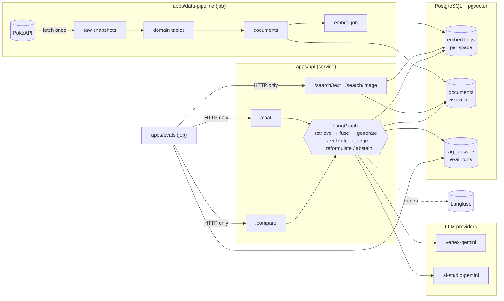

# Pokédex AI — Multimodal RAG Lab

Unofficial, educational project: a Pokédex you can search by text or image, backed by
Retrieval-Augmented Generation over Gen-1 Pokémon data.

- **Retrieval**: PostgreSQL + pgvector — multimodal embeddings + full-text search, fused with RRF
- **Orchestration**: LangGraph
- **Observability**: Langfuse
- **Evaluation**: golden dataset + LLM-as-judge, run as a test suite

## Architecture



Components never import each other — they communicate over HTTP and the shared
database. Only `libs/*` are imported, as Poetry path dependencies.

**Embedding spaces** are isolated: every vector is bound to a space (model + dimensions)
with its own partial HNSW index, and every query resolves exactly one space. Vectors
from different models are never compared.

| Space | Model | Modality | Notes |
|---|---|---|---|
| `gemini-embedding-2-768-v1` | `gemini-embedding-2` | text + images | Default; sprites live here |
| `embeddinggemma-768-v1` | `google/embeddinggemma-300m` | text only | Local CPU baseline; needs the `local` extra |

## Quickstart

```bash
cp .env.example .env                     # fill in your values
docker compose up -d db                  # PostgreSQL + pgvector
docker compose run --rm migrate          # apply schema migrations
cd apps/data-pipeline && poetry install
poetry run pipeline ingest --generation 1   # fetch-once Gen-1 ingest (~10 min, throttled)
poetry run pipeline sprites                 # download sprite files locally
poetry run pipeline embed --sprites         # generate embeddings (paid API)
cd ../.. && docker compose up -d api       # http://localhost:8000/docs
```

Each component's README covers how to run, test and deploy it.

## Components

| Component | Kind | Purpose |
|---|---|---|
| `apps/data-pipeline` | job | Ingest PokéAPI data, build documents, generate embeddings |
| `apps/api` | service | Pokédex + search + RAG chat + provider comparison API |
| `apps/evals` | job | Golden-dataset evaluation runner and report generator |
| `libs/*` | libraries | Shared config/logging/contracts, DB models, embedders, LLM gateway |

## Endpoints

| Endpoint | Purpose |
|---|---|
| `GET /health` | 200/503 with per-dependency detail |
| `GET /pokemon`, `/pokemon/{id_or_name}`, `/pokemon/{id}/evolution-chain` | Record cards |
| `POST /search/text` | Vector / lexical / hybrid (RRF) search, optional `space` |
| `POST /search/image` | Image-to-image match over sprite vectors |
| `POST /chat` | Grounded answer with citations, validated and judged |
| `POST /compare` | Same context, N providers, each judged side by side |

## Testing

```bash
cd <component> && poetry run pytest        # offline: fakes, no network or credentials
RUN_INTEGRATION=1 poetry run pytest        # + dockerized Postgres (opt-in)
cd apps/evals && poetry run evals run --fake-api   # whole eval pipeline, offline
```

CI runs lint, unit tests with per-component coverage floors, an offline
pipeline-integrity check, and integration tests against a real pgvector service.

## Disclaimer

Educational, non-commercial project built to experiment with RAG, multimodal search and
model evaluation. Not affiliated with, sponsored or endorsed by Nintendo, Game Freak,
Creatures Inc. or The Pokémon Company. Pokémon names, characters and images belong to
their respective owners. Data obtained via [PokéAPI](https://pokeapi.co/). No sprite or
artwork files are distributed in this repository.
