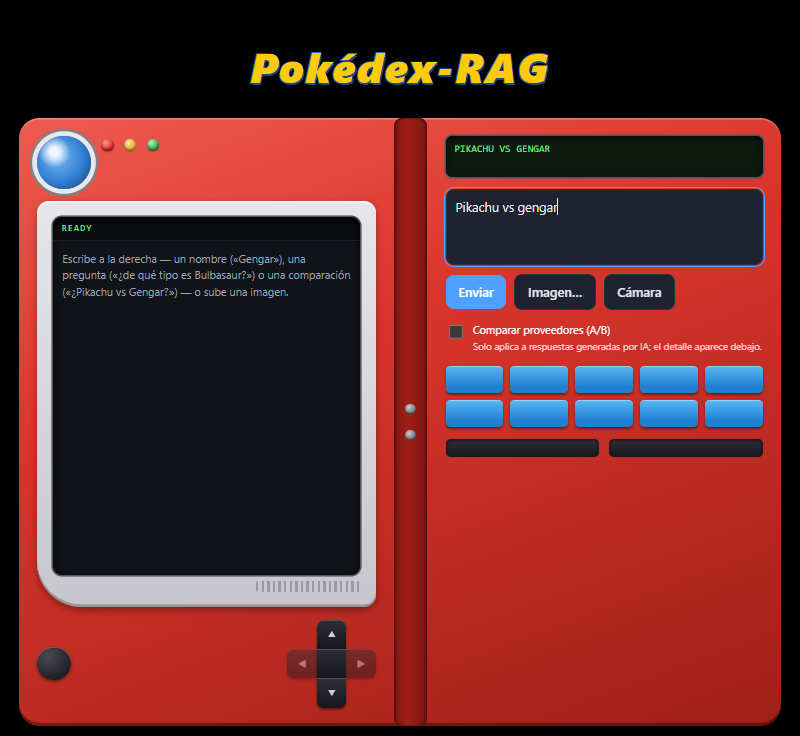
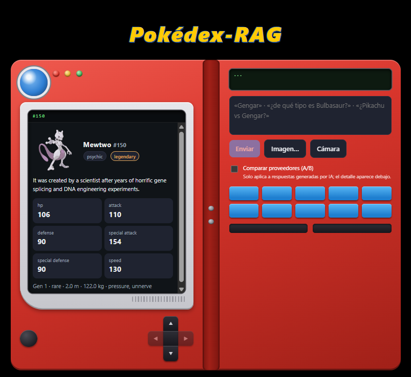
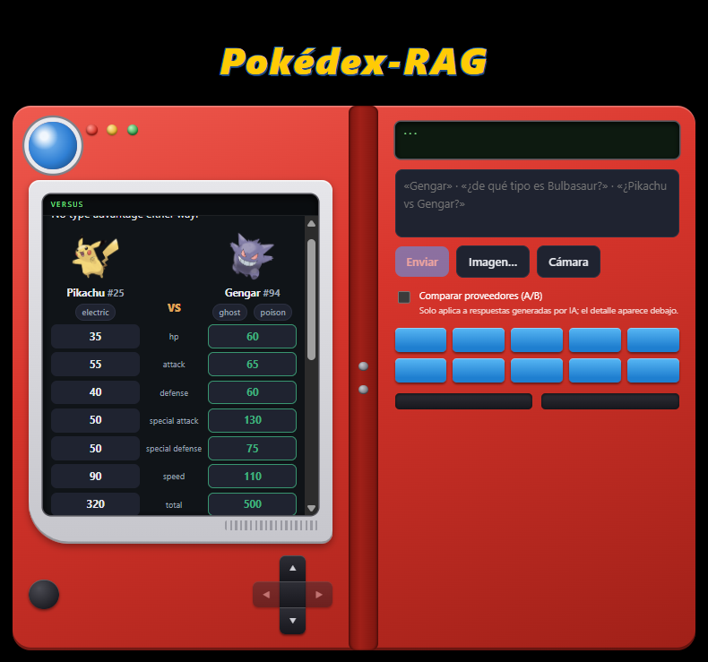
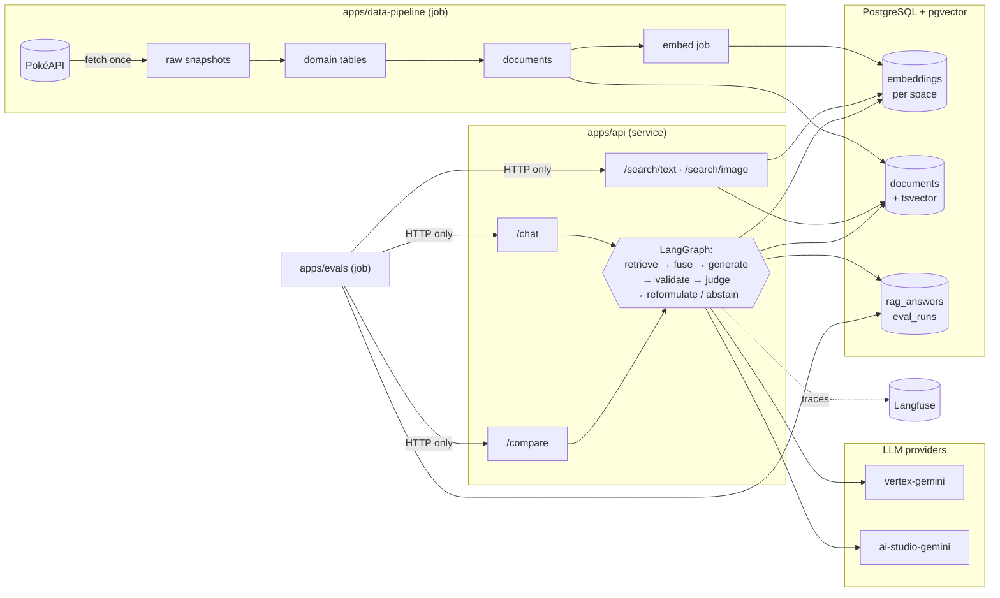

# Pokédex AI — Multimodal RAG Lab

Unofficial, educational project: a Pokédex you can search by text or image, backed by
Retrieval-Augmented Generation over Gen-1 Pokémon data.

- **Retrieval**: PostgreSQL + pgvector — multimodal embeddings + full-text search, fused with RRF
- **Orchestration**: LangGraph
- **Observability**: Langfuse
- **Evaluation**: golden dataset + LLM-as-judge, run as a test suite

## The device

Everything happens inside a Pokédex drawn entirely in CSS — no franchise artwork is
used or redistributed. Type a name, a question or a comparison in any of the supported
languages and an intent classifier routes it; drop in an image and it matches against
sprite vectors.

<p align="center">
  
  
</p>

<p align="center">
  
</p>

The comparison view is computed from the type chart, not generated — the model is never
asked to invent a matchup. Note what it refuses to say: *"no type advantage either way"*
and *"not a battle simulation"*, because base stats plus a type chart do not decide a
battle.

## Architecture



Components never import each other — they communicate over HTTP and the shared
database. Only `libs/*` are imported, as Poetry path dependencies.

**Embedding spaces** are isolated: every vector is bound to a space (model + dimensions)
with its own partial HNSW index, and every query resolves exactly one space. Vectors
from different models are never compared.

| Space | Model | Modality | Notes |
|---|---|---|---|
| `gemini-embedding-2-768-v1` | `gemini-embedding-2` | text + images | Default; sprites live here |
| `embeddinggemma-768-v1` | `google/embeddinggemma-300m` | text only | Local CPU baseline; needs the `local` extra |

## Quickstart

```bash
cp .env.example .env                     # fill in your values
docker compose up -d db                  # PostgreSQL + pgvector
docker compose run --rm migrate          # apply schema migrations
cd apps/data-pipeline && poetry install
poetry run pipeline ingest --generation 1   # fetch-once Gen-1 ingest (~10 min, throttled)
poetry run pipeline sprites                 # download sprite files locally
poetry run pipeline embed --sprites         # generate embeddings (paid API)
cd ../.. && docker compose up -d api       # http://localhost:8000/docs
```

Each component's README covers how to run, test and deploy it.

## Components

| Component | Kind | Purpose |
|---|---|---|
| `apps/data-pipeline` | job | Ingest PokéAPI data, build documents, generate embeddings |
| `apps/api` | service | Pokédex + search + RAG chat + provider comparison API |
| `apps/evals` | job | Golden-dataset evaluation runner and report generator |
| `apps/web` | frontend | The Pokédex device: single-screen static UI with intent routing over the public API |
| `libs/*` | libraries | Shared config/logging/contracts, DB models, embedders, LLM gateway |

### Starting it again (after a reboot, or after stopping)

```bash
make demo        # database + API, waits until /health answers
make web-dev     # the UI on http://localhost:3000
```

```bash
make status      # what is running + row counts, so "is there data?" is one command
make demo-stop   # back to zero running cost
```

**Ingested data survives all of this.** The corpus lives in the `pgdata` Docker volume,
not in the containers, so stopping the stack or rebooting loses nothing — a re-ingest is
never needed. Only `docker compose down -v` would erase it, which is why no Make target
passes `-v`. If the UI shows no data after a restart, the database is almost certainly
fine: check that `NEXT_PUBLIC_API_BASE_URL` in `apps/web/.env.local` points at the API
that is actually running (`make status` shows its port).

## Endpoints

| Endpoint | Purpose |
|---|---|
| `GET /health` | 200/503 with per-dependency detail |
| `GET /pokemon`, `/pokemon/{id_or_name}`, `/pokemon/{id}/evolution-chain` | Record cards |
| `POST /search/text` | Vector / lexical / hybrid (RRF) search, optional `space` |
| `POST /search/image` | Image-to-image match over sprite vectors |
| `GET /pokemon/{id}/sprite` | Serves a downloaded sprite file (the UI's only image source) |
| `POST /chat` | Grounded answer with citations, validated and judged |
| `POST /compare` | Same context, N providers, each judged side by side |
| `POST /intent` | Classifies free text (card / question / compare) with fuzzy bilingual name resolution |
| `POST /matchup` | Deterministic Pokémon-vs-Pokémon: stats, type chart maths, honest verdicts (no LLM) |

## Testing

```bash
cd <component> && poetry run pytest        # offline: fakes, no network or credentials
RUN_INTEGRATION=1 poetry run pytest        # + dockerized Postgres (opt-in)
cd apps/evals && poetry run evals run --fake-api   # whole eval pipeline, offline
```

CI runs lint, unit tests with per-component coverage floors, an offline
pipeline-integrity check, and integration tests against a real pgvector service.

## Disclaimer

Educational, non-commercial project built to experiment with RAG, multimodal search and
model evaluation. Not affiliated with, sponsored or endorsed by Nintendo, Game Freak,
Creatures Inc. or The Pokémon Company. Pokémon names, characters and images belong to
their respective owners. Data obtained via [PokéAPI](https://pokeapi.co/).

No sprite or artwork files are distributed as reusable assets: the sprites the app
displays are downloaded at ingest time into a gitignored `data/` directory. The
screenshots under `assets/screenshot/` are illustrations of the running application and
incidentally show those sprites. The Pokédex device itself is an original CSS
interpretation, not franchise artwork.
